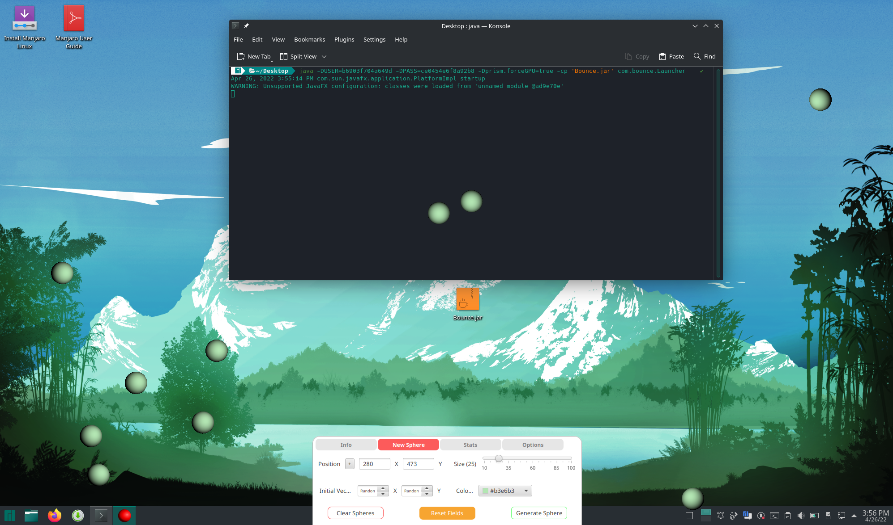
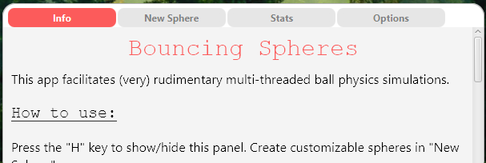
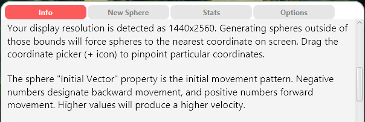
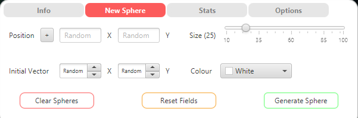
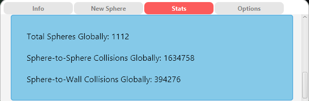
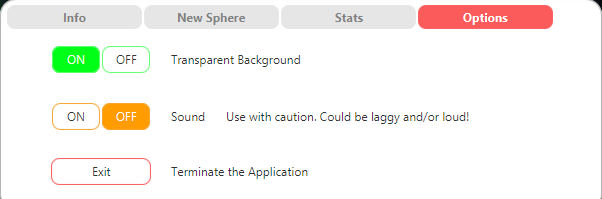

# Bouncing Spheres

https://user-images.githubusercontent.com/74454371/165000805-e67bf423-39a6-4b02-a4bf-7d2efc2e41ee.mp4

---

## Project Description
This is a full-stack, native, multi-threaded program which attempts to simulate simple circle physics.
The application provides granular control over the simulation by means of an intuitive user interface. The goals of this first part
of the project can be ascertained in the [project requirements](meta/Mandatory%20II.pdf); For the second part (a landing site) click [here](https://github.com/Roman-Octavian/Bounce-Site).

Bouncing Spheres can be used to play around with spheres. The user has great control over the emulation, and can therefore
choose to use it to their taste; Some may try to generate as many spheres as possible to strain their computer,
others may want to have a reasonable amount of spheres running in the background as a nice screen saver while they do other things.

---

## Tech Stack

    
    
    
    

 - Front-End with JavaFX
 - Back-End with Heroku ClearDB Database
 - Wrapper with Launch4J

---

## How to Install
The repository can be cloned and subsequently built into your preferred environment.

Additionally, Windows users can download the following executable:

<a href="https://github.com/Roman-Octavian/Bounce/blob/main/bin/Bouncing%20Spheres.exe?raw=true">Executable Download</a>

Running the executable will prompt the user to install Java if an appropriate Runtime Environment is not available. 
In some cases, installing the JDK is also needed to make JavaFX work:

<a href="https://www.oracle.com/java/technologies/downloads/" target="_blank">JDK Download Page</a>

Lastly, a JAR artifact is also available for macOS or Linux. Java and possibly the JavaFX SDK or JDK is required to run it.

<a href="https://github.com/Roman-Octavian/Bounce/blob/main/bin/Bounce.jar?raw=true">JAR Download</a>

<a href="https://gluonhq.com/products/javafx/" target="_blank">JavaFX SDK Download Page</a>

Once these tools have been installed, using any terminal, navigate to wherever the JAR is located on your system and run this command:

`java -DUSER=b6903f704a649d -DPASS=ce0454e6f8a92b8 -cp 'Bounce.jar' com.bounce.Launcher`

If the app does not load properly (spheres won't show up, etc.) try this instead:

`java -DUSER=b6903f704a649d -DPASS=ce0454e6f8a92b8 -Dprism.forceGPU=true -cp 'Bounce.jar' com.bounce.Launcher`

Here's an example of running the app successfully on a VM Manjaro Linux fresh installation:

1. Run `sudo pacman -S jre-openjdk` in default terminal
2. Download the JAR and place it on the Desktop
3. Do `cd Desktop`
4. Do `java -DUSER=b6903f704a649d -DPASS=ce0454e6f8a92b8 -Dprism.forceGPU=true -cp 'Bounce.jar' com.bounce.Launcher`

Program appears to run fine except for some text misplacement. Funnily enough, the same procedure on plain Arch does not render the app properly.

---

## How to Use

On application startup, the user is greeted by a small window at the bottom-middle of the display.

This is the control panel which will facilitate all program functionality to the user.
It should be noted that while only this relatively small panel is visible, the application is actually maximized, and the rest of the display is being occupied by a transparent background.
This can be easily visualized by turning off "Transparent Background" in the "Options" Tab.

The control panel consists of four tabs:

### 1. "Info"

Scrollable Tab which provides basic information to the user. Mentions how to use the features that may be the hardest to grasp. 
Detects the resolution of the display and informs the user of the bounds which will apply to the application.
Note that the resolution might be detected as lower than expected if the display is configured to a higher scale than native.
Has a link that redirects to my GitHub profile for support.

### 2. "New Sphere"

This tab deals with Sphere generation. It has four main fields:

- "Position": Where the Sphere will be generated. Values outside the screen bounds will force the sphere to the nearest valid position. 
The button marked with a "+" symbol right next to the "Position" Label is the Coordinate Picker. It can be dragged along the display to select a specific location aided by a cross-hair view. 
When the selection is released, the coordinates are automatically set in their corresponding fields. Leaving these fields empty will return random values

- "Size": A slider which will denote the radius of a newly generated sphere. The minimum amount is 10 pixels, and the maximum amount is 100.

- "Initial Vector": Denotes the initial movement pattern of the sphere on both the X and Y axis. 
Negative numbers signify backward movement, and positive numbers forward movement. Higher numbers in both directions produce a higher speed.
The options go from -10 to 10, and a "Random" option which randomizes the values is also present.
For example, an initial vector of "X: 5 , Y: 5" will generate a sphere that will move diagonally towards the bottom-right of the screen at 5 pixels per frame:

https://user-images.githubusercontent.com/74454371/165000849-6a151762-9e14-4c7b-a6c1-2ac0d3fedde0.mp4

- "Colour": A colour picker that allows us to determine the colour of the newly generated sphere.

Additionally, three buttons are located at the bottom of the tab:

- "Clear spheres": Will remove all the spheres from the display and interrupt their corresponding threads.

- "Reset fields": Brings all the fields in the tab back to their default values.

- "Generate Sphere": Creates a new sphere which runs on its own thread by taking into account all the fields in the tab.

### 3. "Stats"

Scrollable Tab which provides statistics to the user. Refreshes every time it is initialized. Can be refreshed manually with a "Refresh" button.
Has two sections; Green for the session statistics, and blue for the global statistics. 
"Session" refers to those values generated during the current local session, whereas "Global" to the values collectively generated by all users.

Both sections have:

- "Total Spheres": Amount of spheres generated during the session and by all users since the database was implemented.
- "Sphere-to-Sphere Collisions": Amount of collisions that have taken place between two given spheres during the session and for all users.
- "Sphere-to-Wall Collisions": Amount of collisions that have taken place between a sphere and the edges of the screen during the session and for all users.

The green "Session" section has one additional entry — "Spheres Currently Running", which measures the amount of spheres running at any given time.

It should be noted that, due to limitations of the free plan for the Heroku ClearDB database, the remote database is only queried twice: On application start-up and
on application exit via the "Exit" button in the "Options" tab to update the statistics with the session values. Closing the application through methods other than the
intended one will result in loss of session data.

### 4. "Options"

Lastly, "Options" contains three options:

- "Transparent Background" toggle. Allows turning transparent background on or off. On by default; if off, transparency is replaced by a gray gradient.
- "Sound" toggle. Allows turning sound effects on or off. Off by default because it can get very loud and slow down the application if abused.
- "Exit" button. Terminates the application. Delay of 2-3 seconds between button press and actual termination is due to slow (free plan) database update.

---

## How to Improve

Improvements could be made to the application:
- Add anti-aliasing; tried to but it glitched out
- Improve sphere-to-sphere collision physics
- Improve physics in general (add friction toggle, rotation, etc.)
- Create executables for macOS and Linux
- Make executables reliable (it's a hit or miss whether they work unfortunately)
- Make sound less irritating with high sphere amounts